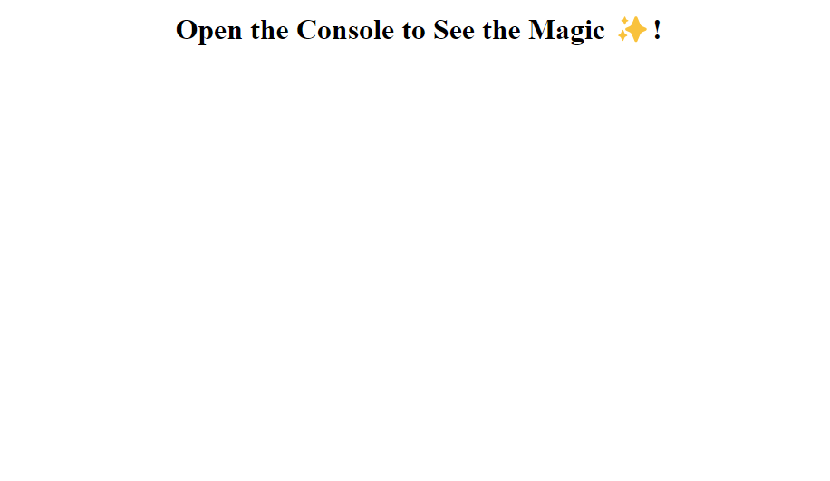
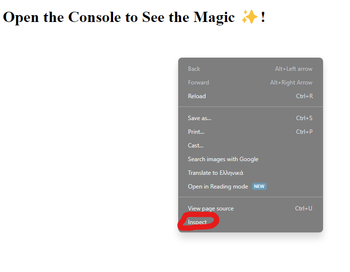
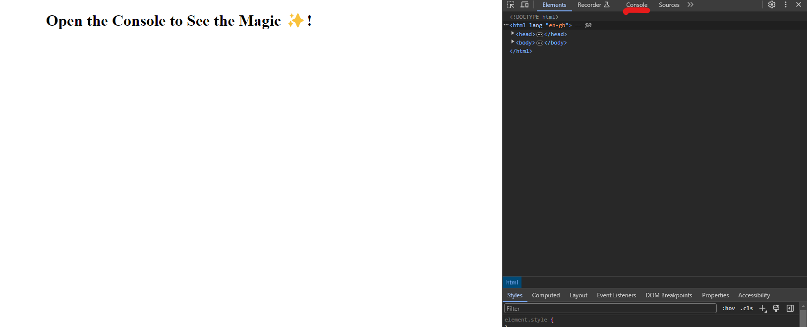
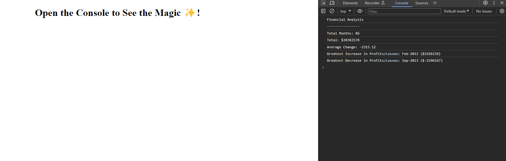

# Console-Finances

## Description

A Javascript console application that will produce output from the contents of two arrays. The challenge for week 4 of the bootcamp.

This application aims to emulate a real world application that receives input in the format of a 2-dimensional array and produces output that is meaningful to the end user (e.g. numerical data and information)

I engaged with this project as it was an opportunity to identify ways to mathematically manipulate array data and present them in a functional way for the end user.

While building this application, I have learnt about two-dimensional arrays and how to call on information from them, how javascript processes mathematical functions, and how to troubleshoot when the application does not behave as expected, by changing elements to identify which part of the application is responsible for the unpredictable output.

## Table of Contents (Optional)

N/A

## Installation

N/A

## Usage

When you open the deployed application [here](https://github.com/Evans20kom/Console-Finances), a blank page will appear that prompts you to look in the console window:
    
    
    
Right click on the page and click "inspect". Alternatively, press F12 on your keyboard.
    
    
    
On the right hand side, you will see a new window. Find the tab that writes "console" at the top, and click on it.
    
    
    
You can see the output of the application on the console window on your right, under the console tab.
    
    

## Credits

A number of sources were used for the development of this application:

<ul>
<li>Chris H - Central Grader: Alerted me to the fact that the presentation of my README file is not the expected one; upon investigating, I realized that markdown syntax was not correct</li>
<li>In my attempt to identify the type of array, I found this source:
https://developer.mozilla.org/en-US/docs/Web/JavaScript/Reference/Global_Objects/Array/map</li>

<li>Identified name of array in starter code here:
https://developer.mozilla.org/en-US/docs/Web/JavaScript/Reference/Global_Objects/Array</li>

<li>Looked for details on two dimensional arrays and code here:
https://www.freecodecamp.org/news/javascript-2d-arrays/</li>

<li>Found how to add within an array here:
https://www.freecodecamp.org/news/how-to-add-numbers-in-javascript-arrays/</li>

<li>Found how to subtract negative numbers here:
https://stackoverflow.com/questions/27589902/addition-and-subtraction-with-negative-numbers</li>

<li>Found how to convert number to string here:
https://www.digitalocean.com/community/tutorials/how-to-convert-data-types-in-javascript#converting-values-to-strings</li>

<li>Found how to round to two decimal points here:
https://codedamn.com/news/javascript/javascript-round-a-number-to-2-decimal-places-with-examples</li>

</ul>

## License

MIT License

🏆 The previous sections are the bare minimum, and your project will ultimately determine the content of this document. You might also want to consider adding the following sections.

## Badges

N/A

## Features

N/A

## How to Contribute

N/A

## Tests

Go the extra mile and write tests for your application. Then provide examples on how to run them here.

# Spark Notes

https://developer.mozilla.org/en-US/docs/Web/JavaScript/Reference/Global_Objects/Array/map

Identified name of array in starter code here:
https://developer.mozilla.org/en-US/docs/Web/JavaScript/Reference/Global_Objects/Array

Looked for details on two dimensional arrays and code here:
https://www.freecodecamp.org/news/javascript-2d-arrays/

Found how to add within an array here:
https://www.freecodecamp.org/news/how-to-add-numbers-in-javascript-arrays/

Found how to subtract negative numbers here:
https://stackoverflow.com/questions/27589902/addition-and-subtraction-with-negative-numbers

Found how to convert number to string here:
https://www.digitalocean.com/community/tutorials/how-to-convert-data-types-in-javascript#converting-values-to-strings

Found how to round to two decimal points here:
https://codedamn.com/news/javascript/javascript-round-a-number-to-2-decimal-places-with-examples

Tests Peformed:
Array calculated separately in Microsoft Excel to establish accuracy of numbers. When numbers at Excel and Console did not match, code was ran in small portion of array. Bug was identified as a mathematical error as minus symbols in deduction cancel out and produce inaccurate results. After research, I used the "parseInt" function to perform additions of numbers.

